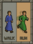

# Smart Walk Run

A RuneLite plugin that automatically toggles run or walk based on configured tiles.

## Features
- Mark tiles as "Walk" or "Run"
- Visual overlay for marked tiles
- Dynamically change walking speed based on tile type, run status, and CTRL key status

## Usage
1. Right-click a tile, hover over "Walk Run", and select "Mark Walk" or "Mark Run"
2. When you left-click to move to that tile, the plugin will automatically ensure you are walking or running as configured.
